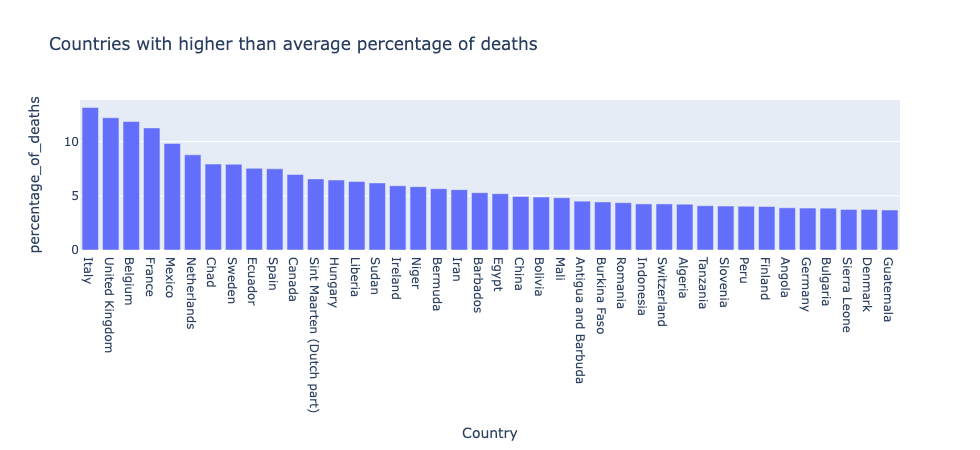
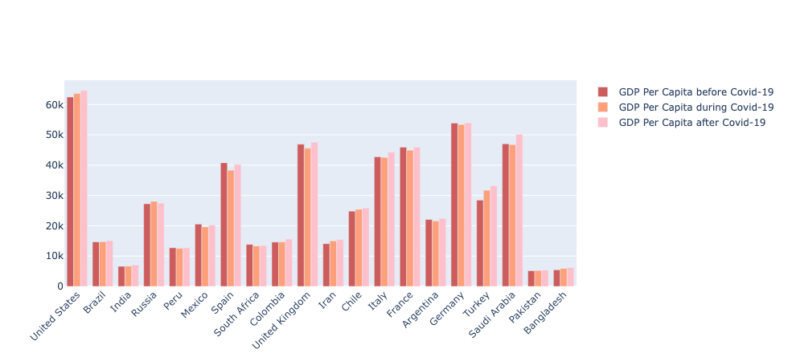

This is a quick analysis of data I found on the number of cases, deaths, and some economic markers (HDI, GDP Per Capita) based on open source data.

I got the data from Kaggle as well as Our World In Data. The data wasn't perfect, and required some merging of different datasets, so it's possible it's not _completely_ reliable. 

These were some of the findings:

